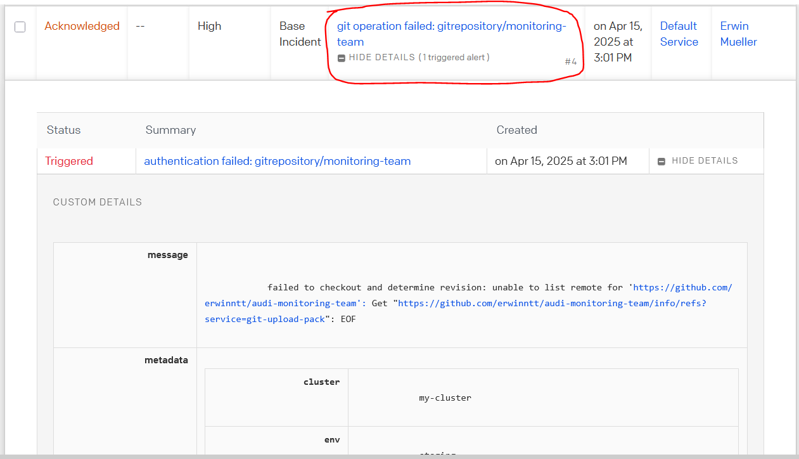

# Audi flux2-multi-tenancy demo


## Introduction

Diese Demo berücksichtigt in den Repositories zur Zeit nur Production und Staging. Diese müssen dann ggf. auf die tatsächlichen Erfordernissen der Zielumgebung angepasst werden.

## Prerequirements

- Repository bei Github erstellen
- Ein Personal Access Token (PAC) für das Repository erstellen
- Das PAC in die Datei `repo-pac.txt` kopieren

## Installation

Zuerst manuell erstellen, dann Flux installieren:

    export GITHUB_TOKEN=`cat repo-pac.txt`
    export GITHUB_USER=erwinntt
    export GITHUB_REPO="https://github.com/erwinntt/audi-flux2-multi-tenancy"

- Erstellen des GPG Private Keys
- Den GPG Private Key in die Variable GPG_KEY exportieren

    gpg --full-generate-key
    gpg --list-secret-keys fluxcdbot@users.noreply.github.com
    gpg --export-secret-keys --armor ${GPG_KEY} | kubectl create secret generic sops-gpg --namespace=flux-system --from-file=sops.asc=/dev/stdin

Flux installieren:

- Den Github User in die Variable GITHUB_USER exportieren
- Den Github Repo in die Variable GITHUB_REPO exportieren

```
flux bootstrap github \
    --owner=${GITHUB_USER} \
    --repository=${GITHUB_REPO} \
    --branch=main \
    --personal \
    --path=clusters/staging \
    --components-extra image-reflector-controller,image-automation-controller
```

```
flux create kustomization tenants \
    --depends-on=kyverno-policies \
    --source=flux-system \
    --path="./tenants/staging" \
    --prune=true \
    --interval=5m \
    --validation=client \
    --decryption-provider=sops \
    --decryption-secret=sops-gpg \
    --export > ./clusters/staging/tenants.yaml
```

## New Team

Ein neues Team wird mit einem eigenes Repository hizugefügt (ggf. Teams IPO, A&F, CP, Next und COM). Hier das Template für die benötigten Schritte.

    flux -n apps create secret git new-team-auth --url=https://github.com/org/audi-new-team --username=user --password=$TOKEN --export > ./tenants/base/new-team/auth.yaml

    sops --encrypt \
        --pgp=${GPG_KEY} \
        --encrypted-regex '^(data|stringData)$' \
        --in-place ./tenants/base/new-team/auth.yaml

    flux create source git new-team \
        --namespace=new \
        --url=https://github.com/org/audi-new-team \
        --branch=main \
        --secret-ref=new-team-auth \
        --export > ./tenants/base/new-team/sync.yaml

    flux create kustomization new-team \
        --namespace=new \
        --service-account=new-team \
        --source=GitRepository/new-team \
        --path="./" \
        --export >> ./tenants/base/new-team/sync.yaml

    cd ./tenants/base/new-team/ && kustomize create --autodetect

## Alerts

### Rocket Chat

Konfiguration von Rocket Chat unter `clusters/production/flux-system/alerts.yaml` und `clusters/staging/flux-system/alerts.yaml`.

Die Rocket Chat Addresse muss in das Secret `rocket-webhook` eingetragen werden als base64 encoded.

```
data:
  address: cm9ja2V0Y2hhdC1yb2NrZXRjaGF0LmZsdXgtc3lzdGVtLnN2Yy5jbHVzdGVyLmxvY2Fs
```

Rocket Chat ist auch per Team konfiguriert in den `base/alerts-rocket.yaml`.

### Pager Duty

Pager Duty ist per Team konfiguriert in den `base/alerts-pager.yaml`.


Zwei Alerts Rocket und Pager usw................. TODO



